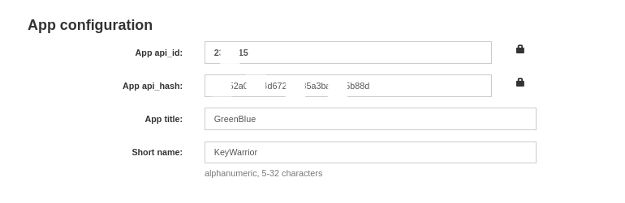
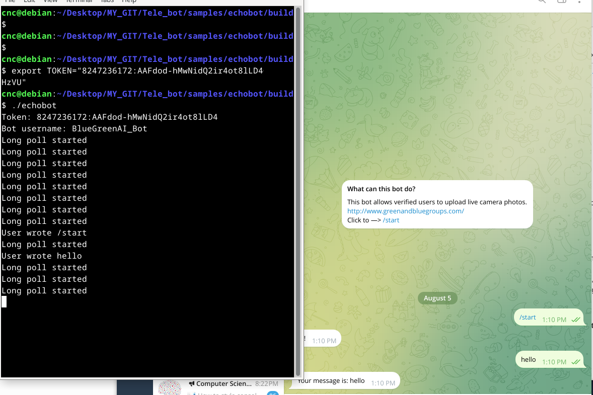

# Tele_bot


### 🔴 Bots **cannot send messages** to other bots

Telegram **blocks bot-to-bot communication**.

### ✅ Bot can only:

* Reply to **users**
* Post in **groups/supergroups** where it's added
* Send messages if **user/group has interacted with it first**

### Summary:

| What         | Possible?                    |
| ------------ | ---------------------------- |
| Bot to User  | ✅ Yes (if user started chat) |
| Bot to Group | ✅ Yes (if added)             |
| Bot to Bot   | ❌ No                         |


If you need two bots to "talk", you must use a **server/middleware** between them.


```
https://my.telegram.org/apps

```


<p float="left">
  
</p>


### Download_site

https://www.boost.org/releases/1.83.0/


```
wget https://archives.boost.io/release/1.83.0/source/boost_1_83_0.tar.gz
tar -xvzf boost_1_83_0.tar.gz
cd boost_1_83_0
```


### build


```
./bootstrap.sh --prefix=/opt/boost_1_83_0


./b2 install \
  --prefix=/opt/boost_1_83_0 \
  --with-system \
  --with-filesystem \
  --with-thread \
  --with-date_time \
  -j2


sudo ./b2 install \
  --prefix=/opt/boost_1_83_0 \
  --with-thread \
  -j2

```


### Confirm It's Installed

Check:

```
ls /opt/boost_1_83_0/lib/libboost_thread*

ls /opt/boost_1_83_0/lib/cmake/boost_thread-1.83.0/

```


### build Bot


```
git clone "https://github.com/reo7sp/tgbot-cpp.git"

cd tgbot-cpp

mkdir build && cd build


cnc@debian:~/Desktop/BOT_BASIC/tgbot-cpp/build$ cmake .. \
  -DBoost_NO_SYSTEM_PATHS=ON \
  -DCMAKE_PREFIX_PATH="/opt/boost_1_83_0" \
  -DBoost_USE_STATIC_LIBS=OFF

```


  
-- The C compiler identification is GNU 12.2.0
-- The CXX compiler identification is GNU 12.2.0
-- Detecting C compiler ABI info
-- Detecting C compiler ABI info - done
-- Check for working C compiler: /usr/bin/cc - skipped
-- Detecting C compile features
-- Detecting C compile features - done
-- Detecting CXX compiler ABI info
-- Detecting CXX compiler ABI info - done
-- Check for working CXX compiler: /usr/bin/c++ - skipped
-- Detecting CXX compile features
-- Detecting CXX compile features - done
-- Performing Test CMAKE_HAVE_LIBC_PTHREAD
-- Performing Test CMAKE_HAVE_LIBC_PTHREAD - Success
-- Found Threads: TRUE  
-- Found ZLIB: /usr/lib/x86_64-linux-gnu/libz.so (found version "1.2.13") 
-- Found OpenSSL: /usr/lib/x86_64-linux-gnu/libcrypto.so (found version "3.0.16")  
-- Found CURL: /usr/lib/x86_64-linux-gnu/libcurl.so (found suitable version "7.88.1", minimum required is "7.58.0")  
-- Found Boost: /opt/boost_1_83_0/lib/cmake/Boost-1.83.0/BoostConfig.cmake (found suitable version "1.83.0", minimum required is "1.65.1") found components: system 
-- Configuring done
-- Generating done
-- Build files have been written to: /home/cnc/Desktop/BOT_BASIC/tgbot-cpp/build


### bot make


```
cnc@debian:~/Desktop/BOT_BASIC/tgbot-cpp/build$ make

```

Then, how to find the location of .a static library files in Linux?


```
cnc@debian:~/Desktop/BOT_BASIC/tgbot-cpp/build$ ls


CMakeCache.txt  CMakeFiles  cmake_install.cmake  libTgBot.a  Makefile

```


alias m='mkdir build && cd build && cmake .. && make'

git clone "https://github.com/Tpj-root/Tele_bot.git"

cd Tele_bot/samples/

m

./echobot 


```
cnc@debian:~/Desktop/MY_GIT/Tele_bot/samples/echobot/build$ 
terminate called after throwing an instance of 'std::logic_error'
  what():  basic_string: construction from null is not valid
Aborted
cnc@debian:~/Desktop/MY_GIT/Tele_bot/samples/echobot/build$ 
```


## Fix:    Set the env variable before running:


```
export TOKEN="8247236172:AAAAAAAAAAAAAAAAAAAAAAAAAAAA"

./echobot

```


<p float="left">
  
  
</p>


### HELP

```
https://core.telegram.org/bots/features#inputs

```


